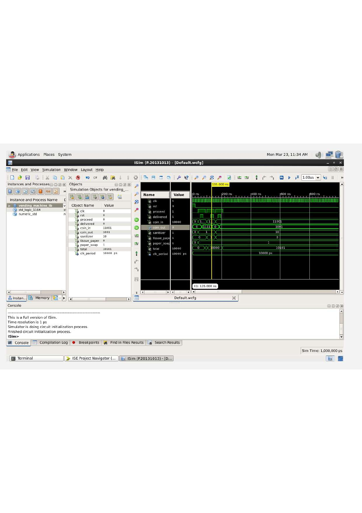
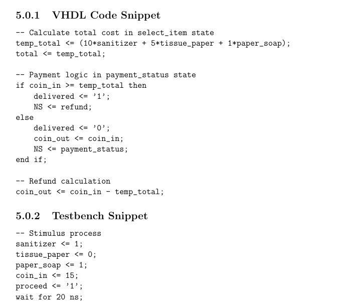
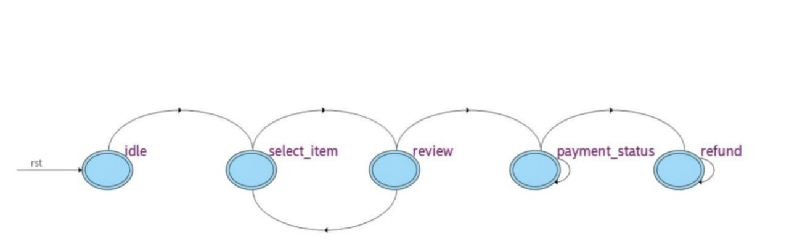

# VHDL-Based Vending Machine Controller using FSM

A sophisticated finite state machine implementation in VHDL that simulates a fully functional vending machine system with intelligent payment verification, product delivery, and refund mechanisms.

---

## About

This project demonstrates advanced digital design principles through the implementation of a comprehensive vending machine controller. Using VHDL and finite state machine concepts, the system elegantly manages complex operational sequences including product selection, payment validation, and transaction completion. The design showcases how formal hardware description languages can model real-world systems with precision and reliability.

The controller supports multiple product offerings and intelligently handles various payment scenarios—from exact payments to overpayments and refunds—all while maintaining strict state consistency throughout the transaction lifecycle.

---

## Technologies

- **Hardware Description Language**: VHDL
- **Design Methodology**: Finite State Machine (FSM)
- **Development Environment**: Xilinx ISE Design Suite 14.7
- **Simulation & Verification**: Hardware simulation tools
- **Architecture Pattern**: Mealy & Moore State Machines

---

## Features

- **Multi-Product Support** — Manage up to three distinct product offerings simultaneously
- **Intelligent Payment Handling** — Automated detection and processing of underpayment, exact payment, and overpayment scenarios
- **Precise State Transitions** — Deterministic FSM ensuring predictable system behavior
- **Automatic Refund System** — Accurate calculation and delivery of refunds when payment exceeds product cost
- **Comprehensive Simulation** — Full verification of all operational states and transactions
- **Hardware-Efficient Design** — Optimized VHDL implementation for minimal resource utilization

---

## Supported Products

| Product | Code | Category |
|---------|------|----------|
| Sanitizer | `P001` | Health & Hygiene |
| Tissue Paper | `P002` | Consumables |
| Paper Soap | `P003` | Health & Hygiene |

---

## The Process

The vending machine controller operates through a carefully designed sequence of states that collectively form a robust transaction management system. Understanding the architecture provides insight into how complex systems are decomposed and implemented at the hardware level.

### Architecture Overview

The FSM-based controller is constructed around several fundamental operational states:

**Idle State** — The system remains in a ready state, awaiting user interaction. No transactions are active, and all outputs are inactive.

**Product Selection State** — Upon user input, the system acknowledges the selected product and validates that it is available in inventory. Product cost information is retrieved and prepared for payment validation.

**Payment Processing State** — The system accumulates payment input from the user and compares it against the product cost. This state handles three distinct scenarios:
- Insufficient payment: System waits for additional funds
- Exact payment: Proceeds directly to product delivery
- Overpayment: Calculates refund amount while preparing for delivery

**Product Delivery State** — Once payment verification is confirmed, the system activates the product dispensing mechanism and tracks successful delivery completion.

**Refund State** — If applicable, the controller calculates and dispenses refund amounts, handling fractional currency values with precision.

**Return to Idle** — Transaction completion triggers a system reset to the idle state, preparing for the next customer interaction.

### State Diagram Logic

Each state transition is governed by explicit conditions and sensor inputs:
- Product availability validation before selection acceptance
- Payment amount comparison against stored product prices
- Delivery confirmation signals before completing transactions
- Refund calculation and dispensing verification

This hierarchical approach ensures that the system can never reach an invalid state and provides fail-safe operation through hardware-enforced constraints.

---

## Running the Project

### Prerequisites

Ensure you have the following software installed:
- Xilinx ISE Design Suite 14.7 (or compatible version)
- VHDL simulator (ISim or ModelSim)
- Standard digital design tools

### Setup Instructions

1. **Clone the Repository**
   ```bash
   git clone https://github.com/Aiswaryacc/VHDL-Based-Vending-Machine-Controller-using-FSM.git
   cd VHDL-Based-Vending-Machine-Controller-using-FSM
   ```

2. **Open Project**
   - Launch Xilinx ISE Design Suite
   - Open the project file (`vending_machine.ise`)
   - All source files will be automatically loaded

3. **Simulate the Design**
   - Navigate to Simulation settings
   - Set simulation time: 200 ns (adjustable based on test scenarios)
   - Select ISim as the preferred simulator
   - Click "Simulate Behavioral Model"

4. **Run Test Cases**
   - The testbench file includes predefined test scenarios
   - Observe waveform outputs in the simulation window
   - Validate state transitions and output signals

5. **Synthesize & Implement** (Optional - for hardware deployment)
   ```
   Process → Translate → Map → Place & Route
   ```

---

## Waveform Output

The simulation generates comprehensive waveform data showing all state transitions, payment calculations, and control signal activations. Below is a representative waveform capture during a complete transaction cycle:

<div align="center">
  
  <p><em>Waveform simulation showing complete transaction sequence with state transitions and control signals</em></p>
</div>

---

## Code Implementation

The VHDL implementation follows industry best practices with clear module separation, descriptive signal naming, and comprehensive documentation. Key design components are organized for maximum readability and maintainability:

<div align="center">
  
  <p><em>Core VHDL implementation showcasing FSM architecture and state machine logic</em></p>
</div>

---

## FSM Flow Diagram

The complete state machine flow is visualized below, illustrating the decision points and transitions governing vending machine operation:

<div align="center">
  
  <p><em>Finite state machine flow diagram with all operational states and transition conditions</em></p>
</div>

---

## Future Improvements

The current implementation provides a solid foundation for several potential enhancements:

- **Digital Currency Support** — Integration with contactless payment systems (NFC, QR codes)
- **Inventory Management** — Real-time stock tracking and low-stock alerts
- **User Interface Enhancement** — LCD display integration for transaction feedback
- **Analytics & Logging** — Transaction history recording and usage statistics
- **Machine Learning Optimization** — Predictive restocking based on usage patterns
- **IoT Connectivity** — Remote monitoring and diagnostics capabilities
- **Multi-Currency Support** — Automatic exchange rate handling for international deployments
- **Advanced Security** — Tamper detection and enhanced fraud prevention mechanisms

---

## Developer

<div align="center">

**Aiswarya C**

ECE Undergraduate  
Content Lead @ IEEE SB GEC Palakkad  
Research Team Member @ Department Magazine EXECOM

</div>

---

<div align="center">

Made with precision and passion for digital design.

</div>